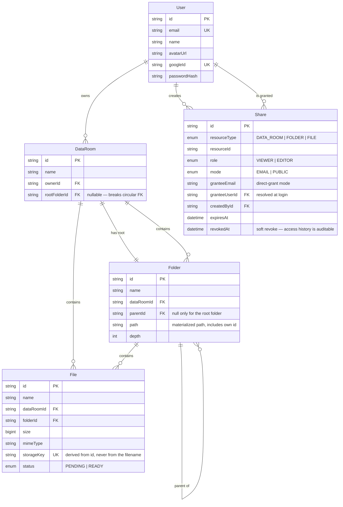

# Data Room

A virtual Data Room — a secure, organized repository for storing and sharing documents,
built for due-diligence workflows (M&A, audits, fundraising).

Think Google Drive, but where every folder and file can be handed to an external party
under an explicit, revocable grant.

**Core capabilities**

- Nested folders with breadcrumb navigation
- Multi-file drag-and-drop upload with per-file progress
- Rename, move, and delete files and folders (with a preview of what a delete removes)
- Sharing at three levels — Data Room, folder, or single file — via public link or
  per-user grant, with inheritance down the subtree and revocation at any time

---

## Live

|          | URL   |
| -------- | ----- |
| Frontend | _TBD_ |
| API      | _TBD_ |

---

## Tech stack

| Layer        | Choice                                                                                   |
| ------------ | ---------------------------------------------------------------------------------------- |
| Monorepo     | Nx, npm                                                                                  |
| Frontend     | React 18, TypeScript, Vite, TanStack Query / Router / Table, Tailwind, shadcn/ui + Radix |
| Backend      | NestJS, TypeScript                                                                       |
| API contract | ts-rest + zod — shared, single source of truth for both ends                             |
| Database     | PostgreSQL (Supabase), Prisma v7 with the `@prisma/adapter-pg` driver adapter            |
| Blob storage | Google Cloud Storage (private bucket, signed URLs)                                       |
| Auth         | Google OAuth 2.0, JWT in an httpOnly cookie                                              |
| Testing      | Vitest (unit), Playwright (e2e), Storybook (components)                                  |

---

## Repository structure

```
apps/
  web          React SPA
  api          NestJS HTTP API
libs/
  contracts    ts-rest contracts + zod schemas — shared by web and api
  database     Prisma schema, migrations, PrismaService
  ui           Design system: shadcn/ui components + Tailwind preset
```

Dependency rules between these projects are enforced by lint, not convention.
See [ARCHITECTURE.md](./ARCHITECTURE.md#project-graph-and-module-boundaries).

---

## Getting started

### Prerequisites

- Node.js **>= 20.19** (required by Prisma v7)
- npm
- A Supabase project (free tier is enough)
- A Google Cloud project with a Storage bucket and a service account
- Google OAuth 2.0 credentials

### 1. Clone and install

```bash
git clone <repo-url>
cd dataroom
npm install
```

### 2. Configure environment

```bash
cp .env.example .env
```

Fill in the values. Grouped by whether a variable is needed everywhere, only for local
development, or set to a different value per environment:

**Required everywhere** (local dev, CI, and production)

| Variable               | What it is                                                    | Where to get it                                                                              |
| ---------------------- | --------------------------------------------------------------- | --------------------------------------------------------------------------------------------- |
| `DATABASE_URL`         | **Pooled** Postgres connection (pgBouncer, port 6543)            | Supabase → Settings → Database → Connection pooling                                           |
| `JWT_SECRET`           | Signing secret for session tokens                                | Generate: `openssl rand -base64 32`                                                           |
| `JWT_EXPIRES_IN`       | Session token lifetime — no default, security-relevant          | `7d`                                                                                           |
| `GOOGLE_CLIENT_ID`     | OAuth client id                                                  | Google Cloud Console → Credentials                                                            |
| `GOOGLE_CLIENT_SECRET` | OAuth client secret                                              | Google Cloud Console → Credentials                                                            |
| `GOOGLE_CALLBACK_URL`  | OAuth redirect target                                            | `http://localhost:3000/api/auth/google/callback` locally; the Cloud Run URL + the same path in production |
| `WEB_APP_URL`          | SPA origin the API redirects back to after login/error          | `http://localhost:4200` locally; the Vercel production URL in production                      |
| `CORS_ORIGINS`         | Comma-separated allowlist of origins allowed to call the API    | Same as `WEB_APP_URL` — never a wildcard                                                      |
| `GCS_PROJECT_ID`       | GCP project id                                                   | Google Cloud Console                                                                          |
| `GCS_BUCKET_NAME`      | Storage bucket name                                              | Google Cloud Console → Cloud Storage                                                          |
| `VITE_API_URL`         | API base URL for the SPA, consumed by `apps/web/src/lib/api.ts` | `/api` in every environment — see "Frontend" below |

**Local only** — never set in production

| Variable           | What it is                                                              | Where to get it                                     |
| ------------------- | ------------------------------------------------------------------------- | ----------------------------------------------------- |
| `DIRECT_URL`        | **Direct** Postgres connection (port 5432) — migrations only, run from a dev machine, never read by the running API | Supabase → Settings → Database → Direct connection |
| `GCS_CLIENT_EMAIL`  | Service account email — explicit credentials, only needed where Application Default Credentials are unavailable | Service account JSON key |
| `GCS_PRIVATE_KEY`   | Service account private key (keep the `\n` escapes)                     | Service account JSON key |

Leave `GCS_CLIENT_EMAIL`/`GCS_PRIVATE_KEY` **both** unset in production: `StorageService`
then signs via Application Default Credentials and the IAM Credentials API instead,
using the deployed service account's own identity — see "Deployment" and
[ARCHITECTURE.md](./ARCHITECTURE.md)'s decision log. Setting only one of the two fails
validation at boot (`env.schema.ts`) — a half-configured credential is a
misconfiguration, not a fallback.

**Differs by environment**

| Variable           | What it is                          | Local (`nx serve`) | Production                              |
| ------------------- | -------------------------------------- | -------------------- | ------------------------------------------ |
| `COOKIE_SECURE`     | Session cookie `Secure` attribute      | `false`              | `true`                                     |
| `COOKIE_SAME_SITE`  | Session cookie `SameSite` attribute    | `lax`                 | `none` — see "Cookies across origins" below |
| `COOKIE_DOMAIN`     | Session cookie `Domain` attribute      | unset                 | unset (Vercel and Cloud Run share no parent domain) |
| `PORT`              | Port the API listens on                | `3000`                | injected by Cloud Run — never hardcode     |

> **Cookies across origins.** `COOKIE_SECURE=true` and `COOKIE_SAME_SITE=none` are
> required in production. The SPA (Vercel) and API (Cloud Run) are different origins;
> `SameSite=Lax` silently drops the cookie on that cross-site request. Login still
> *appears* to succeed — the OAuth redirect completes — but the cookie never round-trips
> back, so every subsequent request 401s.

**Optional** — every one of these has a sensible default (`env.schema.ts`)

| Variable                          | What it is                                                  | Default          |
| ---------------------------------- | --------------------------------------------------------------- | ------------------ |
| `MAX_FILE_SIZE_BYTES`              | Largest upload accepted, checked before the upload starts       | `104857600` (100 MB) |
| `ALLOWED_MIME_TYPES`               | Comma-separated allowlist for `mimeType`                        | `application/pdf` |
| `UPLOAD_URL_TTL_MINUTES`           | How long a signed upload URL stays valid                        | `15`               |
| `DOWNLOAD_URL_TTL_MINUTES`         | How long a signed download/view URL stays valid                 | `15`               |
| `PENDING_TTL_MINUTES`              | Age at which an unconfirmed upload is considered abandoned      | `60`               |
| `PENDING_SWEEP_INTERVAL_MINUTES`   | How often the abandoned-upload sweep runs — see "File storage" below | `15`          |

> Two database URLs are not redundant. Migrations cannot run through pgBouncer in
> transaction mode — it does not support prepared statements or advisory locks.
> Runtime traffic goes through the pooler; migrations go direct.
>
> If `DIRECT_URL` (the `db.<ref>.supabase.co:5432` host) times out with `P1001`, your
> network most likely has no outbound IPv6 route — that host is IPv6-only unless the
> project has Supabase's IPv4 add-on. The fix is Supabase's **Session Pooler**: the same
> host and credentials as `DATABASE_URL`, but port `5432` and without `?pgbouncer=true`.
> Unlike the transaction-mode pooler (port 6543), session mode supports migrations.

### 3. Set up the database

```bash
npx nx run database:prisma-migrate-dev      # create + apply a migration (uses DIRECT_URL)
npx nx run database:prisma-migrate-deploy   # apply pending migrations, no new one (CI/prod)
npx nx run database:prisma-generate         # generate the client — Prisma v7 does not do this automatically
```

### 4. Configure bucket CORS

The browser uploads directly to GCS via signed URLs, so the bucket must accept
cross-origin `PUT` requests from the frontend origin. See
[ARCHITECTURE.md](./ARCHITECTURE.md#file-upload-two-phase-with-signed-urls) and "File
storage" below for the exact CORS JSON.

### 5. Run

```bash
npx nx serve api     # http://localhost:3000
npx nx serve web     # http://localhost:4200
```

### Common tasks

```bash
npx nx run-many -t lint,test,build   # everything
npx nx affected -t lint,test         # only what changed
npx nx graph                         # visualize the project graph
npx nx e2e web-e2e                   # Playwright
npx nx storybook ui                  # component workshop
```

---

## Authentication

Google OAuth 2.0 only — no email/password. The flow:

```
GET  /api/auth/google            browser → 302 → Google's consent screen
GET  /api/auth/google/callback   Google → 302 → validates profile, upserts the User,
                                  resolves pending share invitations, sets the session
                                  cookie, 302 → WEB_APP_URL (or WEB_APP_URL?error=... on
                                  denied consent, an unverified email, or a provider
                                  failure — the API never renders its own error page)
GET  /api/auth/me                200 + the current user, or 401
POST /api/auth/logout            clears the cookie, 204, idempotent
```

The session is a single JWT (`sub`, `email` — no roles or permissions; those are always
resolved per request from the database), delivered as an **httpOnly cookie**, never in a
response body or `localStorage`, and never re-issued — there is no refresh token or
token rotation. This is a documented simplification: a compromised token is valid until
it expires (7 days by default, `JWT_EXPIRES_IN`).

**Cookie attributes come from config, not hardcoded values**, because the correct
settings differ by environment:

| Attribute  | Local (`nx serve`)        | Production (cross-site SPA + API)   |
| ---------- | -------------------------- | ------------------------------------ |
| `httpOnly` | `true`                     | `true`                               |
| `secure`   | `false` (`COOKIE_SECURE`)  | `true`                                |
| `sameSite` | `lax` (`COOKIE_SAME_SITE`) | `none` — required once the SPA and API are on different origins |
| `path`     | `/`                        | `/`                                  |

Getting `sameSite`/`secure` wrong only fails after deploying to separate origins (the
browser silently drops the cookie), so it's worth double-checking `COOKIE_SAME_SITE` and
`COOKIE_SECURE` are actually set to the production values above before shipping — see
`.env.example`.

**Testing permissioned sharing locally requires two separate Google accounts** — one to
create a Data Room and share it, a second to receive the invitation and log in as the
grantee. A single account can't exercise the "shared with me" side of any sharing test.

---

## Frontend

`apps/web` is a Vite SPA using TanStack Router (code-based route tree, not file-based —
see [ARCHITECTURE.md](./ARCHITECTURE.md)'s decision log) and `@ts-rest/react-query` for
data fetching, with `GET /api/auth/me` as the single source of truth for who is logged in.

| Path    | Screen           | Guard                                          |
| ------- | ---------------- | ----------------------------------------------- |
| `/`     | Landing          | Authenticated users are redirected to `/home`   |
| `/home` | Signed-in home   | Unauthenticated users are redirected to `/`     |

`VITE_API_URL` is a **relative** path (`/api`) in every environment — the SPA never calls
the API cross-origin. Locally, `apps/web/vite.config.mts` proxies `/api` to
`http://localhost:3000`; in production, the root [`vercel.json`](./vercel.json) rewrites
`/api/:path*` to the Cloud Run API. Both make the request same-origin from the browser's
point of view, which is what keeps the session cookie first-party — see
[ARCHITECTURE.md](./ARCHITECTURE.md)'s decision log for why this replaced an earlier
cross-site cookie approach.

---

## File storage

File bytes never pass through the API — the browser talks to Google Cloud Storage
directly, over signed URLs the API issues. See
[ARCHITECTURE.md §5](./ARCHITECTURE.md#file-upload-two-phase-with-signed-urls) for the
full rationale; this section is the operational summary.

### The two-phase flow

```
1. POST /api/files/upload-url    -> validates, reserves a PENDING File row, returns
                                     { fileId, uploadUrl, expiresAt }
2. PUT  <uploadUrl>               -> the browser uploads straight to GCS with
                                     Content-Type set to exactly the declared mimeType
                                     (it's part of the signature — a mismatched header
                                     is rejected by GCS with 403)
3. POST /api/files/:id/complete  -> the API reads the object's real size and content
                                     type back from GCS and flips PENDING -> READY
```

`size` in step 1 is advisory only (used to reject an oversized upload before it starts,
`413`) — it is never persisted. The row's real `size`/`mimeType` always come from GCS in
step 3, never from anything the client claims. `GET /api/files/:id/download-url` is the
read-side equivalent: a signed GET URL with the response forced to `inline` disposition,
so the browser renders a PDF instead of downloading it.

### Bucket CORS

The bucket is private, and the browser calls it cross-origin (from `WEB_APP_URL`) for
both the upload `PUT` and, if the frontend fetches bytes directly rather than navigating
to the signed URL, the download `GET`. Configure it once per bucket:

```json
[
  {
    "origin": ["http://localhost:4200"],
    "method": ["PUT", "GET"],
    "responseHeader": ["Content-Type"],
    "maxAgeSeconds": 3600
  }
]
```

```bash
gcloud storage buckets update gs://<GCS_BUCKET_NAME> --cors-file=cors.json
```

Add every environment's frontend origin (production, staging, …) to `origin` — it is not
read from `CORS_ORIGINS`; that env var configures the API's own CORS, a separate surface
from the bucket's.

### Abandoned uploads

A client that requests an upload URL but never calls `complete` (closed the tab,
cancelled, the PUT failed) leaves a `PENDING` row and, possibly, an orphaned blob.
`PENDING` rows are invisible to listings and size aggregates regardless, and a periodic
sweep (`PendingSweepService`, `@nestjs/schedule`) deletes any row still `PENDING` past
`PENDING_TTL_MINUTES`, along with its blob.

**This sweep is best-effort on Cloud Run.** It runs in-process, on an interval
(`PENDING_SWEEP_INTERVAL_MINUTES`) — which only ticks while an instance is alive. On
scale-to-zero, a Data Room with no traffic simply accumulates unswept `PENDING` rows
until the next request wakes an instance; they still never appear in listings or
aggregates in the meantime, so this is a storage-hygiene gap, not a correctness one. A
production deployment would replace it with Cloud Scheduler hitting an authenticated
sweep endpoint — not built here, a deliberate simplification for this iteration.

---

## Data model



### Key modelling decisions

**Every Data Room owns a root folder.**
Without it, "top level" would mean `folderId = null`, and every listing, move,
breadcrumb, and permission check would carry a special case. Worse, Postgres treats
NULLs as distinct, so `UNIQUE (folderId, name)` would silently fail to prevent
duplicate filenames at the top level — precisely where users upload most. With a root
folder, the corner case disappears: the root is an ordinary node.

**Folders carry a materialized path.**
`path` stores the full ancestor chain (`/rootId/childId/thisId/`). Ancestors are
derived by parsing a string rather than by walking parent pointers, which turns three
otherwise-recursive operations into single indexed queries: breadcrumbs, subtree
aggregates, and inherited-permission resolution.

**`storageKey` is derived from the file id, never from its name.**
The blob store is a flat key-value space that knows nothing about names or hierarchy;
all structure lives in Postgres. Renaming or moving a file is therefore a pure database
update with zero storage calls, and name-conflict resolution costs nothing.

**Shares are a single flat table covering both modes.**
Public links and per-user grants are the same statement — _someone holds role R on
resource X_ — differing only in who "someone" is: anyone (a `PUBLIC`-mode share) or a
specific user (an `EMAIL`-mode share's `granteeUserId`). Keeping `role` on the same row
for both modes is what makes the viewer/editor extension below a no-op. A shared
resource's app URL is the same either way — there's no token in the URL to distinguish
them; `resolveAccess` grants a `PUBLIC` share to any caller, including one with no
session at all.

**`granteeEmail` and `granteeUserId` are both stored.**
Email is what the owner typed and works before the invitee has an account. `granteeUserId`
is the stable subject, resolved once at login against a provider-verified email.
Permission checks read only the user id — email is never an access key, because email
ownership can change hands and would otherwise transfer access with it.

**Revocation is soft.**
`revokedAt` rather than a delete. In a due-diligence context, _who had access to what,
and when_ has legal weight, and the UI can distinguish "revoked" from "never existed".

**File upload is two-phase.**
`POST /files/upload-url` reserves a `File` row (`status: PENDING`) and returns a signed
URL; the browser then `PUT`s straight to GCS; `POST /files/:id/complete` records the real
size/mimeType and flips the row to `READY`. Reserving the row before any bytes move means
a name conflict (`UNIQUE (folderId, name)`) surfaces as an immediate `409`, not after an
80&nbsp;MB upload — and file bytes never transit the API, so Cloud Run's request-body
limit never becomes a product constraint. A client that uploads but never confirms leaves
a `PENDING` row; those are excluded from listings and size aggregates, and are swept after
a timeout.

**`BigInt` is serialized globally, once.**
`File.size` is `BigInt` in Postgres/Prisma — `JSON.stringify` throws on `BigInt` by
default, and every contract schema types `size` as `z.string()`, never `z.number()`
(2^53 is not a limit worth inheriting for a document store). Rather than converting at
every call site, `apps/api/src/bigint-json.ts` teaches `JSON.stringify` how to serialize
`BigInt` (`BigInt.prototype.toJSON`), imported once for its side effect at the top of
`main.ts` before the app boots.

Full rationale, including alternatives that were rejected, is in
[ARCHITECTURE.md](./ARCHITECTURE.md).

---

## How it scales

### Computing total size and item count of a folder's whole subtree

The materialized path makes a subtree a **prefix range**, so the entire subtree is one
indexed scan rather than a recursive traversal:

```sql
SELECT COALESCE(SUM(f.size), 0) AS total_size,
       COUNT(*)                 AS file_count
FROM files f
JOIN folders d ON d.id = f.folder_id
WHERE d.path LIKE '/root/a/b/%'
  AND f.status = 'READY';
```

Folder count is the same predicate against `folders`. Because `path` is indexed and the
pattern is left-anchored, Postgres uses the index directly.

This is exposed as a dedicated endpoint (`GET /folders/:id/stats`) rather than being
folded into folder metadata, precisely so the expensive aggregate is paid for only when
someone asks for it — navigation does not.

**Beyond roughly a million rows per Data Room**, this becomes a denormalized counter:
`size` and `count` columns on `Folder`, updated for the ancestor chain inside the same
transaction as the mutation (the chain is already known from `path`). Reads drop to O(1);
the write cost is bounded by tree depth. The endpoint boundary means this swap is
invisible to the client.

### What changes when one Data Room holds 100,000 files

**Listing** — never unbounded. `GET /folders/:id/children` is cursor-paginated on a
stable composite key (`(name, id)` or `(createdAt, id)`), with `limit` defaulting to 50
and capped at 100.

**Pagination** — cursor, not offset. `OFFSET 90000` forces Postgres to walk and discard
90,000 rows; a keyset cursor (`WHERE (name, id) > (:lastName, :lastId)`) seeks straight
into the index and stays constant-time regardless of depth. It is also correct under
concurrent inserts, where offset pagination silently skips or repeats rows.

**Indexes** — `(folderId, createdAt)` for default listing, `UNIQUE (folderId, name)` for
name-ordered listing and conflict detection, `(dataRoomId)` for room-wide scans, and a
GIN trigram index on `name` once filename search is enabled.

**Frontend** — infinite scroll backed by TanStack Query, with the row list virtualized so
DOM size stays bounded no matter how many pages are loaded.

**Counts** — an exact `COUNT(*)` over a large subtree is itself an expensive query, so
totals come from the `stats` endpoint (cacheable, on demand), never inline with listing.

### Extending sharing to per-user roles without remodelling

Already supported. `Share.role` is an enum on the same row for both share modes, so
adding capabilities means adding enum values, not restructuring tables.

Permission resolution collects every non-revoked, non-expired share matching the target
resource, any of its ancestor folders, or its Data Room — one query, because the
ancestors come from `path` — and takes the **strongest** matching role. Grant a user
`VIEWER` on a Data Room and `EDITOR` on one folder inside it, and the more permissive
grant wins within that subtree.

Extending to `COMMENTER`, `OWNER`, or granular capabilities means adding enum values and
mapping them to capability checks in the authorization guard. Neither the schema nor the
resolution query changes.

---

## Deployment

| Component    | Target                                  |
| ------------ | --------------------------------------- |
| `apps/web`   | Vercel — static SPA build               |
| `apps/api`   | Google Cloud Run — containerized NestJS |
| Database     | Supabase Postgres                       |
| Blob storage | Google Cloud Storage (private bucket)   |

The API sits on Cloud Run rather than a serverless function platform for two reasons:
NestJS runs unmodified in a container, and the API never proxies file bytes — uploads and
downloads go browser-to-GCS through signed URLs, so platform request-size limits are
irrelevant.

### Building and running the API container

`apps/api/Dockerfile` is a two-stage build: `build` carries the full Nx/TypeScript/Prisma
toolchain and is discarded entirely; `runtime` only receives the already-built, already-
pruned `apps/api/dist` (its own `package.json` + production-only `node_modules`), run as
the image's non-root `node` user.

```bash
# --platform is required — Cloud Run does not run arm64 images, and an Apple Silicon
# build without it produces an image that pushes and deploys fine but fails at container
# startup with an error that doesn't obviously point at the architecture mismatch.
docker buildx build --platform linux/amd64 -f apps/api/Dockerfile -t dataroom-api .

docker run --rm -p 8080:8080 -e PORT=8080 \
  -e DATABASE_URL=... -e JWT_SECRET=... -e JWT_EXPIRES_IN=7d \
  -e GOOGLE_CLIENT_ID=... -e GOOGLE_CLIENT_SECRET=... -e GOOGLE_CALLBACK_URL=... \
  -e WEB_APP_URL=... -e CORS_ORIGINS=... \
  -e GCS_PROJECT_ID=... -e GCS_BUCKET_NAME=... \
  -e COOKIE_SECURE=true -e COOKIE_SAME_SITE=none \
  dataroom-api

curl -i localhost:8080/api/health
```

`GCS_CLIENT_EMAIL`/`GCS_PRIVATE_KEY` are deliberately omitted from that `docker run` —
in production they stay unset, and `StorageService` signs via Application Default
Credentials and the IAM Credentials API's `signBlob` instead, using the Cloud Run
service account's own identity (it needs `roles/iam.serviceAccountTokenCreator` on
itself). See [ARCHITECTURE.md](./ARCHITECTURE.md)'s decision log and the "Local only"
env table above.

### Deploying to Cloud Run

`npm run deploy:api` (`scripts/deploy-api.sh`) builds `apps/api/Dockerfile` via Cloud
Build (`apps/api/cloudbuild.yaml` — needed because the Dockerfile's build context is the
repo root but the file itself lives under `apps/api/`, which plain
`gcloud run deploy --source` can't express) and points the Cloud Run service at the
resulting image. It does not set the service's runtime env vars (`DATABASE_URL`,
`JWT_SECRET`, ...) or run migrations — those are managed separately, same as the manual
build above (`gcloud run services update --set-env-vars` / `--update-secrets`, or the
Console).

Deploys into the same GCP project as `GCS_PROJECT_ID` (no separate "which project" var).
Set `CLOUD_RUN_REGION` and `CLOUD_RUN_SERVICE` once in your own `.env` (see
`.env.example`) — the script loads it automatically, so every later deploy is just:

```bash
npm run deploy:api
```

A var already exported in the calling shell overrides `.env` for that one run, e.g. to
deploy a different service without editing `.env`:

```bash
CLOUD_RUN_SERVICE=dataroom-api-staging npm run deploy:api
```

Requires `gcloud auth login` (or equivalent ADC) with permission to submit Cloud Builds
and deploy to Cloud Run in that project, plus `roles/artifactregistry.admin` (or
equivalent) the first time — the script creates the Artifact Registry Docker repo
(`ARTIFACT_REPO`, default `cloud-run-source-deploy`) itself if it doesn't exist yet.

### Migrations

Never run from the container. Applied from a developer machine, against the direct
connection:

```bash
npx nx run @dataroom/database:prisma-migrate-deploy   # DIRECT_URL, no new migration created
```

### Deploying the SPA

Vercel builds `apps/web` — set **Output Directory** to `apps/web/dist` in the Vercel
project's build settings (confirmed via `npx nx build @dataroom/web`; not configured in
`vercel.json`, which only handles the SPA rewrite — see the root `vercel.json`).

---

## Documentation

| File                                   | For                                                              |
| -------------------------------------- | ---------------------------------------------------------------- |
| `README.md`                            | Getting started, data model, scaling                             |
| [`ARCHITECTURE.md`](./ARCHITECTURE.md) | Design rules, module boundaries, domain invariants, decision log |
| [`AGENTS.md`](./AGENTS.md)             | Operating instructions for AI coding agents                      |
